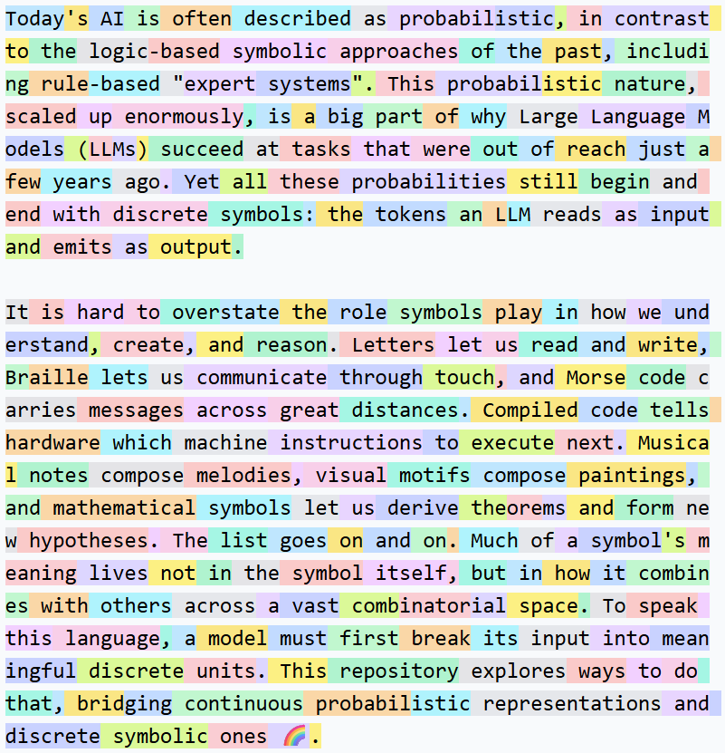
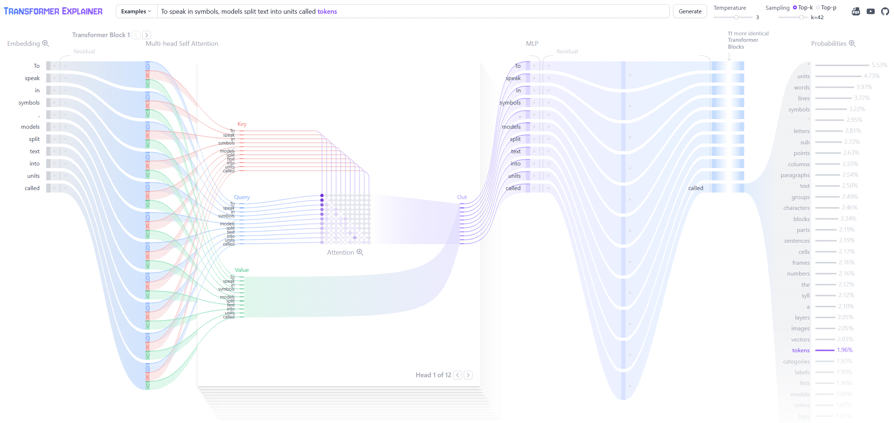

<h1 align="center">Understanding Tokenization</h1>

<p align="center">
  
  <br />
  <em>Created using the "gpt-4 tokenizer" in <a href="https://tiktokenizer.vercel.app/?model=gpt-4">Tiktokenizer</a>, which splits this text into 243 tokens.</em>
</p>

### Before diving into tokenization, you may want to explore the Transformer architecture with [Transformer Explainer](https://poloclub.github.io/transformer-explainer/).

<p align="center">
  
  <br />
  <em>Created using <a href="https://poloclub.github.io/transformer-explainer/">Transformer Explainer</a>. Try your own text to see how the model processes tokens and predicts the next token.</em>
</p>

## About this repository

This repository supplements the **[Understanding Transformers](https://github.com/ducspe/understanding_transformers_workshop)** workshop with a video tutorial, a presentation, code, and a guided notebook for exploring tokenization and byte pair encoding (BPE). The workshop uses a character-level tokenizer, where every character is its own token. This repository shows how real language models split text into larger pieces, and why that choice matters.

A Transformer works with numbers. A tokenizer converts text into token IDs, which the model then maps to embeddings.

## Where to start

| If you want to... | Open | Time |
| --- | --- | --- |
| Get the big picture without writing code | The [video tutorial](extra_material/UnderstandingTokenization_VideoTutorial.mp4), with [English subtitles](extra_material/UnderstandingTokenization_Subtitles_EN.srt) | 21 minutes |
| Build a tokenizer yourself | [BPE_Tokenizer_Notebook.ipynb](BPE_Tokenizer_Notebook.ipynb), after the [setup](#setup) below | about an hour |
| Keep a reference at hand | The slides as [PDF](extra_material/UnderstandingTokenization.pdf) or [PowerPoint](extra_material/UnderstandingTokenization.pptx) | as needed |

If tokenization is new to you, watch the video first. It introduces tokens, byte pair encoding, and the surprising model behaviours that follow from them, using examples you can reproduce in [Tiktokenizer](https://tiktokenizer.vercel.app/?model=gpt-4). Then open the notebook, where you build a small BPE tokenizer step by step; familiarity with Python lists, dictionaries, and loops is enough to begin. Finally, explore the Python classes and run the comparison script to see how different approaches tokenize the same text.

## Video and presentation

The video tutorial **“How Do Language Models See Text? A Primer on Tokenization”** walks through the slides in 21 minutes. You can play the [MP4](extra_material/UnderstandingTokenization_VideoTutorial.mp4) in the browser on GitHub or download it; most video players can load the [subtitle file](extra_material/UnderstandingTokenization_Subtitles_EN.srt) alongside it.

The same presentation is available as a [PDF](extra_material/UnderstandingTokenization.pdf) for browser viewing or as a [PowerPoint](extra_material/UnderstandingTokenization.pptx) for download. The PowerPoint includes speaker notes with additional references, and the last slide lists every paper, library, tool, and article mentioned.

## Repository overview

The Python modules live in `src/`. The notebook and training article are at the repository root. The video, slides, and figures are in `extra_material/`, and `tokenizer_outputs/` holds generated example files.

The four core Python files have different roles:

- [tokenizer_base.py](src/tokenizer_base.py) provides the common base class and shared helpers for counting pairs, merging tokens, and saving/loading trained tokenizers.
- [basic_bpe.py](src/basic_bpe.py) learns BPE merges across the full sequence of bytes, so a merge can cross word boundaries.
- [regex_bpe.py](src/regex_bpe.py) first splits text into chunks using a regular expression, then learns BPE merges that stay within those chunks.
- [gpt4_tokenizer_wrapper.py](src/gpt4_tokenizer_wrapper.py) loads pretrained `cl100k_base` rules through `tiktoken` and uses them to encode and decode text without training.

| File | Purpose |
| --- | --- |
| [BPE_Tokenizer_Notebook.ipynb](BPE_Tokenizer_Notebook.ipynb) | Guided introduction to bytes, BPE training, encoding, and decoding |
| [compare_tokenizers.py](src/compare_tokenizers.py) | Train on the article, compare token counts, check round trips, and save readable `.vocab` files |
| [compare_merges.py](src/compare_merges.py) | Compare shared tokens and their merge positions in a readable Markdown table |
| [william_shakespeare_wikipedia_article.txt](william_shakespeare_wikipedia_article.txt) | Training and evaluation text, with source attribution |
| [requirements.txt](requirements.txt) | Dependencies for the scripts and a notebook kernel |
| [extra_material/](extra_material/) | Video tutorial with subtitles, slides as PDF and PowerPoint, and the figures shown above |

## Setup

Tested with **Python 3.12**. From the repository directory, create and activate a virtual environment, then install the dependencies.

On Linux, macOS, or WSL:

```bash
python3 -m venv .tokenizervenv
source .tokenizervenv/bin/activate
python -m pip install -r requirements.txt
```

On Windows PowerShell:

```powershell
python -m venv .tokenizervenv
.\.tokenizervenv\Scripts\Activate.ps1
python -m pip install -r requirements.txt
```

`regex` supplies the regular-expression engine, `tiktoken` supplies the pretrained vocabulary, and `ipykernel` lets the environment run notebook cells. The repository was last checked with `tiktoken` 0.14 and `regex` 2026.9.

The notebook uses only the Python standard library and runs offline. The comparison scripts need internet access once, when `tiktoken` downloads the `cl100k_base` vocabulary; it is cached afterwards. If you plan to run them during a workshop on restricted Wi-Fi, run them once beforehand.

Open `BPE_Tokenizer_Notebook.ipynb` in VS Code with its Python and Jupyter extensions, select the `.tokenizervenv` interpreter as the kernel, and run the cells from top to bottom. To use JupyterLab in a browser instead, install it with `python -m pip install jupyterlab` and run `jupyter lab` from the repository directory.

## The learning path

We start with basic BPE, add regex splitting, then explore pretrained rules and special tokens.

### 1. Build byte-level BPE, then reuse it as a class

The notebook starts with Shakespeare-inspired text containing accents, unusual letters, and emoji. These examples help explain why a visible character can occupy several UTF-8 bytes.

We begin with **256 tokens**, one for each possible byte value. Training repeatedly counts neighboring token pairs and combines the most frequent pair into a new token. For example, repeated `a` and `b` bytes might eventually become one token representing `ab`.

The notebook builds the pieces in order: `get_stats()`, `merge()`, the training loop, `decode()`, and `encode()`.

Two dictionaries connect the steps:

| Data structure | What it stores | What it helps us do |
| --- | --- | --- |
| `merges` | A pair of token IDs → the learned token ID | Apply the merge rules during encoding |
| `vocab` | A token ID → the bytes it represents | Recover the original bytes during decoding |

For example, if training combines `t` and `h` into token `258`, the corresponding dictionary entries are:

```python
merges[(116, 104)] = 258
vocab[258] = b"th"
```

The byte values `116` and `104` represent `t` and `h`. The `merges` entry tells the encoder **which two tokens can become one**. The `vocab` entry tells the decoder **which bytes that token represents**; `b"th"` means the bytes for `th`.

**Training learns the merge rules. Encoding reuses them.** Decoding joins the resulting bytes and converts them back to text. Training a tokenizer is separate from training the Transformer itself.

[basic_bpe.py](src/basic_bpe.py) packages the same steps into **`BasicBPETokenizer`**, with `train()`, `encode()`, and `decode()` methods. It processes the full byte sequence, so learned tokens can cross word, number, or punctuation boundaries. It treats special-marker strings as ordinary text.

### 2. Add regex splitting with `RegexBPETokenizer`

[regex_bpe.py](src/regex_bpe.py) adds a preparation step: a regular expression splits the text into chunks before BPE processes it.

For example, the default pattern splits `Hello123!` into:

```text
[Hello] [123] [!]
```

BPE learns one shared vocabulary from all the chunks, but **merges only happen within a chunk**. During encoding, each chunk is processed separately and its token IDs are appended to the result. Some pattern rules keep a leading space with the following word.

The regex pattern is predefined; training learns the BPE merges. That is why we call the class **RegexBPETokenizer**: it combines regex splitting with byte-level BPE.

Comparing it with `BasicBPETokenizer` shows how adding chunk boundaries changes the tokens we learn.

### 3. Reuse pretrained rules with `GPT4TokenizerWrapper`

[gpt4_tokenizer_wrapper.py](src/gpt4_tokenizer_wrapper.py) builds on `RegexBPETokenizer` using the existing **`cl100k_base`** vocabulary from `tiktoken`.

The wrapper reconstructs the merge rules and handles the byte-to-ID mapping required by that encoding. It then uses our Python BPE implementation to tokenize text. Its vocabulary is already learned, so we do not call `.train()` on it.

### 4. Handle special tokens

Special tokens are markers such as `<|endoftext|>` that have dedicated IDs. When enabled, the whole marker becomes one token instead of being processed as ordinary text.

For example, with a `GPT4TokenizerWrapper` instance:

```python
from src.gpt4_tokenizer_wrapper import GPT4TokenizerWrapper

tokenizer = GPT4TokenizerWrapper()
special_text = "<|endoftext|>Hello, Shakespeare! 🌙"
token_ids = tokenizer.encode(special_text, allowed_special="all")
assert tokenizer.decode(token_ids) == special_text
```

The comparison script checks all five special markers registered by the wrapper, including their interaction with ordinary text and Unicode.

## Run the comparison

With the virtual environment activated, run from the repository root:

```bash
python -m src.compare_tokenizers
```

The script reads `william_shakespeare_wikipedia_article.txt` and writes `tokenizer_outputs/` in the current directory. The Python files use package-relative imports, so run the comparison as a module with `-m`. On the first run, `tiktoken` downloads and caches the public `cl100k_base` vocabulary. Tokenization then runs locally.

The script:

1. Reads the article and removes the attribution header from the input text.
2. Uses the first 80% of paragraph blocks for training and reserves the rest for evaluation.
3. Trains `BasicBPETokenizer` and `RegexBPETokenizer` on the same text, each with **512 tokens**: 256 byte tokens plus 256 learned merges.
4. Encodes the same evaluation text with all three tokenizers and checks that decoding recovers it exactly.
5. Checks the wrapper's special-token encoding against `tiktoken` and verifies decoding too.
6. Saves readable `.vocab` files in `tokenizer_outputs/` inside the repository.

With the included article, the token counts are:

| Tokenizer | Vocabulary entries, excluding special tokens | Evaluation tokens |
| --- | ---: | ---: |
| `BasicBPETokenizer` | 512 | 3,678 |
| `RegexBPETokenizer` | 512 | 3,820 |
| `GPT4TokenizerWrapper` | 100,256 | 1,687 |

The script prints these token counts in the terminal. IDs belong to their tokenizer's vocabulary; the same number need not represent the same bytes across tokenizers.

The first two rows isolate the effect of regex splitting: their training text and vocabulary size match. Basic BPE can merge across boundaries that the regex pattern keeps separate, and produces fewer tokens here.

The pretrained comparison involves a different vocabulary size and training history. The evaluation paragraphs were held out from **our two trained tokenizers**; we do not know whether the pretrained tokenizer encountered them. The count measures sequence length, not the quality of a language model.

## Explore the output files

Explore the included vocabulary files, or open them side by side in VS Code:

| File | What it shows |
| --- | --- |
| [basic_bpe.vocab](tokenizer_outputs/basic_bpe.vocab) | Vocabulary learned by merging across the full byte sequence |
| [regex_bpe.vocab](tokenizer_outputs/regex_bpe.vocab) | Vocabulary learned with merges restricted to regex chunks |
| [gpt4.vocab](tokenizer_outputs/gpt4.vocab) | The pretrained `cl100k_base` vocabulary |

The first 256 entries are the base byte tokens. After those, each line shows the two pieces that were merged, the resulting piece, and its token ID. For example, `basic_bpe.vocab` contains:

```text
[t][h] -> [th] 258
```

This means: **combine `t` and `h` into `th`, and give it token ID `258`.** Spaces inside brackets are part of the token.

Start at token ID **256** to compare the first merges. In the two tokenizers trained here, smaller merged-token IDs mean earlier training merges. Follow later rows to see how earlier pieces combine into larger ones. The GPT-4 file shows pretrained rules; they were not learned from our article.

Some byte tokens display as `�` because they contain only part of a UTF-8 character. Control characters are escaped, for example a newline appears as `\u000a`. These files are illustrations for reading.

### How the dictionaries relate to the files

`merges` and `vocab` are Python dictionaries used while the tokenizer runs. Saving produces files with two different purposes:

| File | Purpose |
| --- | --- |
| `.model` | **For code to load.** Stores the merge rules in order and the tokenizer settings, such as the regex pattern and special tokens. |
| `.vocab` | **For people to read.** Uses `merges` to identify the two pieces and `vocab` to display their contents, producing lines like `[t][h] -> [th] 258`. |

The first line of a `.model` file stores the regex pattern; it is blank for basic BPE. The following lines store the special-token count, any special tokens, and the merge pairs.

**The merge section is the saved form of our `merges` dictionary.** For example, the first three rules learned by Basic_BPE give us these entries:

```python
merges[(101, 32)] = 256
merges[(115, 32)] = 257
merges[(116, 104)] = 258
```

They become these lines in the `.model` file's merge section:

```text
101 32
115 32
116 104
```

The new token IDs are **implicit in the order**: the first merge pair gets ID `256`, the second gets `257`, and the third gets `258`. That is why preserving the order of the lines matters.

When loading a `.model` file, the code reads the pairs in order and assigns those IDs to restore `merges`. It then starts with the 256 byte tokens and joins their bytes according to the saved rules to rebuild `vocab`. **One `.model` file is enough to recreate both dictionaries without training again.**

The comparison saves `basic_bpe.model` and `regex_bpe.model` alongside their `.vocab` illustrations. The GPT-4 wrapper exports only its `.vocab` file; its pretrained rules are loaded through `tiktoken` each time it is created.

These generated files are included as examples so you can inspect them before running the scripts. Re-running the scripts replaces them with the results of your current settings.

## Compare when tokens appear

Do the tokenizers learn the same pieces of text, and how early do those pieces appear? Explore the [included merge comparison](tokenizer_outputs/merge_comparison.md) to see the results without running any code.

To regenerate the comparison after running `compare_tokenizers.py`, run:

```bash
python -m src.compare_merges
```

The script loads our two saved `.model` files and obtains GPT-4's pretrained rules through the wrapper. It compares **the resulting token bytes**, so `[ab][c]` and `[a][bc]` both count as the same token, `abc`.

A short preview appears in the terminal. Open `tokenizer_outputs/merge_comparison.md` in VS Code's Markdown preview to see the full table:

| Token | Basic_BPE position | Regex_BPE position | GPT-4 position | Regex_BPE − Basic_BPE | Regex_BPE − GPT-4 |
|---|---:|---:|---:|---:|---:|
| `th` | 3 | 72 | 84 | +69 | -12 |
| `in` | 13 | 5 | 3 | -8 | +2 |

These examples come from the included article with a vocabulary size of 512. Position **1** is the first merge after the 256 base byte tokens. For `th`, Regex_BPE reaches it 69 positions later than Basic_BPE and 12 positions earlier than GPT-4. Positive differences mean later, negative differences mean earlier, and `—` means a token is missing from that vocabulary.

The default table contains every merged token learned by Basic_BPE or Regex_BPE, with GPT-4's position alongside it when available. Rows follow Basic_BPE's order, followed by tokens found only in Regex_BPE among our two trained tokenizers. Quotes preserve spaces, and incomplete UTF-8 sequences appear as escaped bytes. Base byte tokens and special tokens are excluded.

For the larger table that also includes tokens found only in GPT-4, run:

```bash
python -m src.compare_merges --all-tokens
```

Both commands replace the same report. Differences measure **merge order**, not speed or quality. GPT-4's positions come from its pretrained rules, with different training data and a much larger vocabulary.

## Extend the Transformer workshop with BPE

The [Understanding Transformers workshop](https://github.com/ducspe/understanding_transformers_workshop) uses a character tokenizer in `mini_gpt.ipynb`: each character gets its own token ID. As a follow-up exercise, explore what changes when you use the larger pieces of text learned by BPE. You can choose from the three tokenizer implementations provided here:

- [BasicBPETokenizer](src/basic_bpe.py) learns merges across the full byte sequence.
- [RegexBPETokenizer](src/regex_bpe.py) adds regex boundaries that restrict where merges happen.
- [GPT4TokenizerWrapper](src/gpt4_tokenizer_wrapper.py) loads pretrained `cl100k_base` rules, so you do not train this tokenizer yourself.

Our comparison script trains the first two on the supplied Wikipedia article about Shakespeare and saves their `.model` files in `tokenizer_outputs/`. You can reuse those trained tokenizers to encode the plays from the transformer workshop. **Tokenizer training and language-model training can use different texts:** the tokenizer learns how to split text into pieces, while mini-GPT learns to predict which piece comes next.

Most of the mini-GPT notebook can stay the same. The main changes are:

1. **Replace the character mapping.** Use your trained or loaded tokenizer's `encode` and `decode` methods in place of the notebook's character-based functions.
2. **Update the vocabulary size.** For our two trained BPE tokenizers, set `vocab_size = len(tokenizer.vocab)`. The notebook already uses this value to size its embedding table and output layer.
3. **Rebuild the data and train a fresh model.** Encode the workshop's training and validation text with the same tokenizer, then create the model and optimizer again and train. Token IDs now refer to different pieces of text, so the model needs to learn these new meanings.
4. **Start generation with an encoded prompt.** Replace the all-zero initial context with the token IDs for any non-empty text prompt. A single space or newline is enough; an empty string produces no starting tokens. Use the same tokenizer to decode the generated sequence.

The attention blocks and training loop can remain unchanged. Start with the 512-token `RegexBPETokenizer` from the comparison. Both small tokenizers round-trip the workshop's `input.txt` exactly, but they differ a lot in speed, because the basic tokenizer rescans the entire text for every merge rule while the regex tokenizer works on short chunks:

| Tokenizer | Tokens for the workshop's `input.txt` (1,115,394 characters) | Time to encode |
| --- | ---: | ---: |
| `RegexBPETokenizer`, 512 tokens | 635,730 | about 2 seconds |
| `BasicBPETokenizer`, 512 tokens | 654,995 | about 45 seconds |

Either way, the token sequence is roughly 40% shorter than the character sequence, so the same `block_size` covers more text. The pretrained wrapper is a more demanding extension because its much larger vocabulary increases the model size, and using special tokens requires accounting for their IDs.

Compare how many tokens represent the same passage, how much text fits in the same context window, and how the generated text changes. Fewer tokens do not automatically mean better generation, and loss per token is measured over different units when you change tokenizers.

## Try it yourself

- Change the shared `vocab_size` from 512 to 1,024 in the comparison script. How do the token counts and training times change?
- Train both BPE classes on another article and evaluate them on the same reserved text. Which patterns does each learn?
- Encode a sentence containing accents and emoji. Check that decoding recovers every character.
- Compare the `merges` and `vocab` dictionaries of `basic_bpe_tokenizer` and `regex_bpe_tokenizer` after training. Can you find a basic BPE token that crosses a regex boundary?
- Open the three `.vocab` files at token ID 256. Compare their first ten merges, then find a later token built from an earlier merged piece.
- Open `merge_comparison.md` and find a shared token that appears much earlier in one approach. Can the regex chunk boundaries help explain the difference?

Keep experiments small: this implementation favors readability. The training loop needs enough remaining byte pairs to complete the requested merges; a very short text with a large vocabulary request can exhaust them. The pretrained wrapper supports encoding and decoding, but not training or model save/load.

## Acknowledgments

The tokenizer implementations are inspired from [Andrej Karpathy's minbpe](https://github.com/karpathy/minbpe). Our current repository adds explanations, examples, and comparison tools for learning about tokenization.

This work was made possible with the help of the following institutions:

- Helmholtz Center Hereon, Geesthacht, Germany
- Helmholtz AI

This work was supported by the Helmholtz Association Initiative and Networking Fund through the Helmholtz AI [grant number: ZT-I-PF-5-01].
